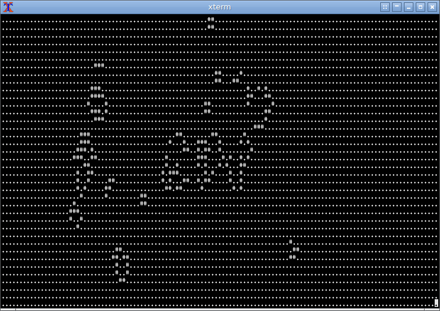
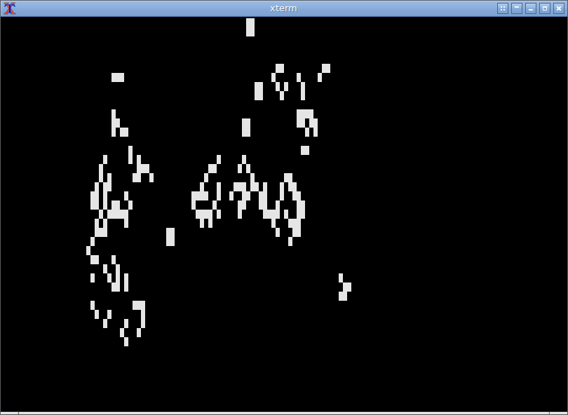
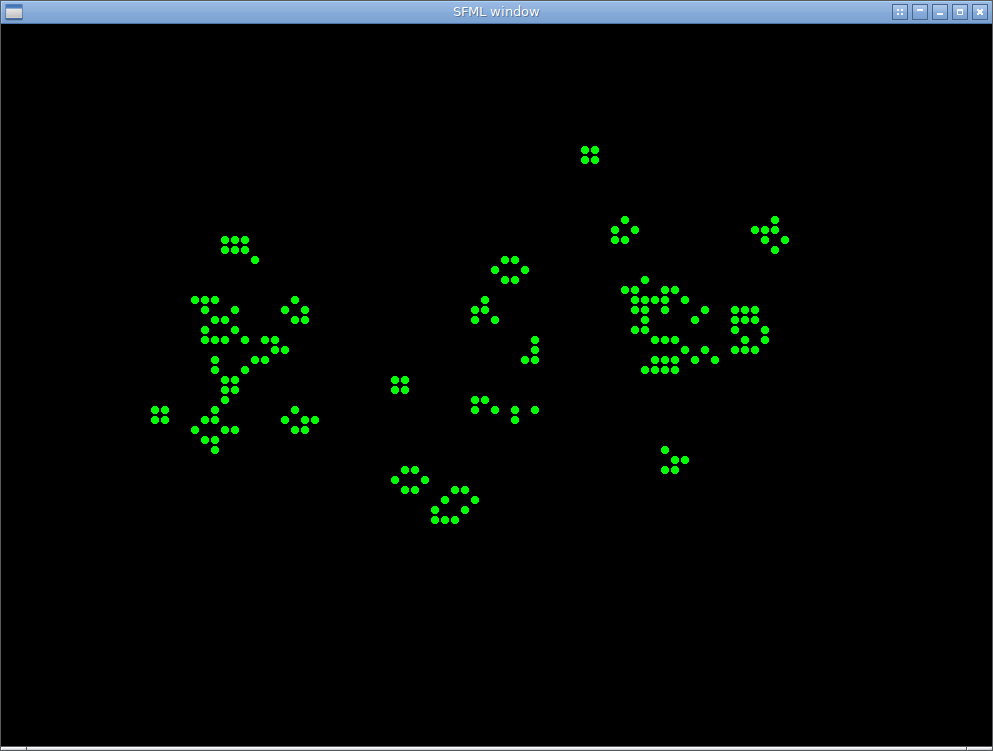

# Game Of Life - C++

* Game of Life [1]. In C++. Just for fun.
* Simplified as much as possible, ~700 chars of code.
* Learning new tricks!
[1] https://en.wikipedia.org/wiki/Conway%27s_Game_of_Life

## Usage

Check the format of any `.matrix` file. Matrix files are the initial setup to run the game.

```
mkdir build
cd build
cmake ..
make
cd ..
./gameoflife-text    [SOME_FILE.matrix] # plain text
./gameoflife-ncurses [SOME_FILE.matrix] # ncurses
./gameoflife-sfml    [SOME_FILE.matrix] # sfml window
```
## Example output


### Plain Text



### NCURSES



### SFML


