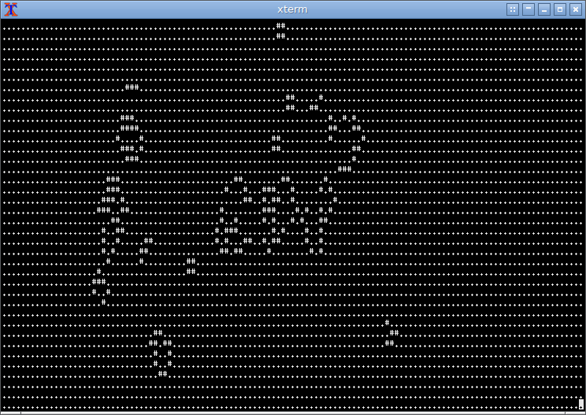
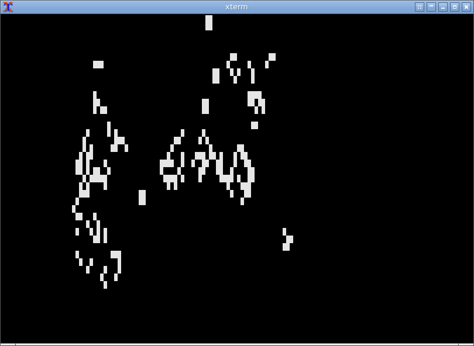
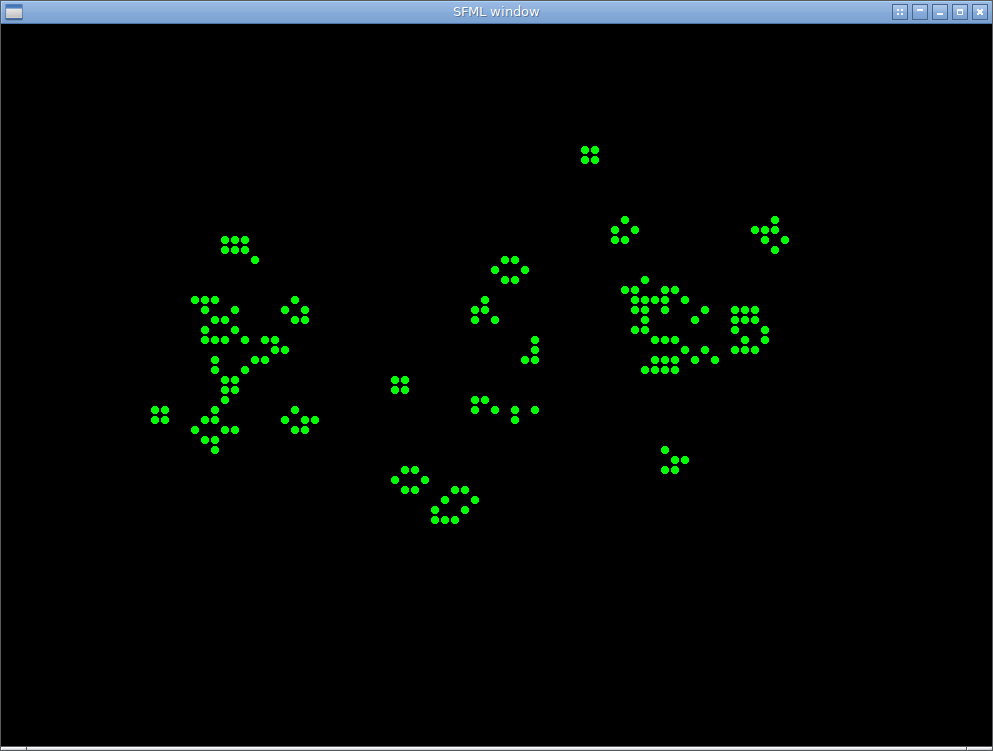

# Game Of Life - C++

* Game of Life [1]. In C++. Just for fun & learning new tricks!
* Simplified as much as possible, the original (and functional) version (see `standalone/golife.cpp`) has 665 chars.
* Using CMake to make an elementary dependency injection. See the CMake `add_executable()` dependency injection mechanism.
* Following a comment from [danielyerena6](https://github.com/danielyerena6), moved to an _MVC_ (model-view-controller) pattern. The model implements the game, the controller implements the evolution of the game, and the view controls the display mechanism, selected by means of dependency injection.
* Patterns taken from http://www.radicaleye.com/lifepage/glossary.html

[1] https://en.wikipedia.org/wiki/Conway%27s_Game_of_Life

## Compilation

```
mkdir build && pushd !!
cmake ..
make
popd
```

## Usage

Check the format of any `.matrix` file. Matrix files are the initial setup to run the game.

```
./gameoflife-text    [SOME_FILE.matrix] # plain text
./gameoflife-ncurses [SOME_FILE.matrix] # ncurses
./gameoflife-sfml    [SOME_FILE.matrix] # sfml window
```
## Example output


### Plain Text



### Ncurses



### SFML


